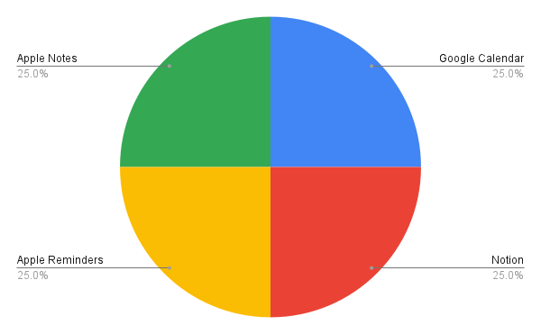
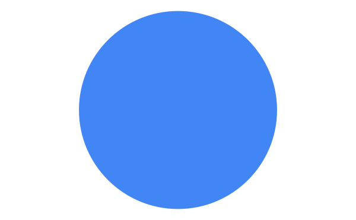

# Productivity Apps

### Discover 🌏 top productivity apps.

As a technology person (CTO, Product Manager, Project Manager, Software Engineer, Designer, Quality Assurance, Quality Control, etc), which productivity apps are you using?

Let’s see which ones other people are choosing!

  
How to 😊 contribute your productivity 🚀 apps?

  
  #### Please kindly only edit ✍️ at **Technology People** section and follow below ⬇️ template.
  ~~~
  

  
Your name Country flag - Current job position.

  
  - Describe your productivity app and its purpose.
  - ...

  

  ~~~

### 🌳 Summary

#### 🧜‍♀️ By App

#### 👩‍💻 By Job Position

#### 🌏 By Country

View the excel file report [here.](https://docs.google.com/spreadsheets/d/1S3tbzGKTX40qNmMo88tkAPYUshp2uZaoCoAwR2IjXNM/edit?usp=sharing)

### 🧚‍♀️ Technology People 

  
Nguyễn Duy Cương (Harry Tran) 🇻🇳 - Software Engineer.

  
  - Google Calendar: manage and remind my anniversaries & my works.
  - Notion: take work notes and documents.
  - Apple Reminders: manage and remind personal tasks.
  - Apple Notes: take personal notes.

  
Vi Chí Thiện (tvc12) 🇻🇳 - Software Engineer.

  
  - [Google Calendar](https://calendar.google.com/calendar): remind my meetings and my anniversaries.
  - [Workflowy](https://workflowy.com/): manage my daily task.
  - [Miro](https://miro.com/): draw code flow, take task notes.
  - [Spotify](https://open.spotify.com/): relaxing, make new ideas.

  
Trần Minh Triết (triet1213) 🇻🇳 - UI/UX Designer.

  
  - [Bear](https://bear.app/): take work notes and documents.
  - [Google Calendar](https://calendar.google.com/calendar): manage and remind for work.
  - [Notion](https://www.notion.so/): store important content and data.
  - [Grammarly](https://www.grammarly.com/): correct spelling and grammar errors.

  
Trương Quang Hiếu (quanhieu) 🇻🇳 - Software Engineer.

  
  - [Google Calendar](https://calendar.google.com/calendar): mark and announce the schedule for me.
  - [Youtube](https://www.youtube.com/): relaxing and learn new thing.
  - [GNOME System Monitor](https://extensions.gnome.org/extension/120/system-monitor/): check system status such as memory, CPU, network rates.
  - [Dark Reader](https://darkreader.org/): make the browser darker and my eyes could relax.
  - [SMPlayer](https://www.smplayer.info/): the video player on ubuntu without annoying notification.

#### Feel free 😊 to contribute, Cheers!!!

